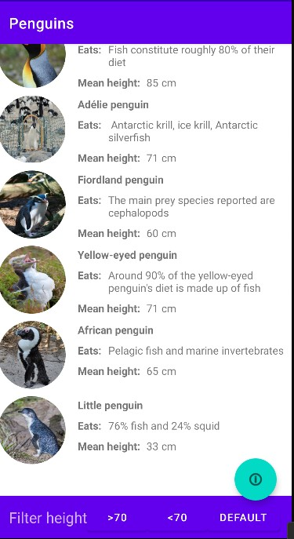
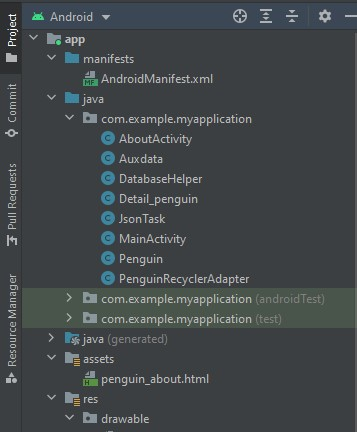
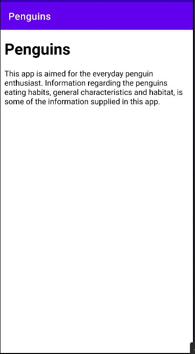

# Rapport Projekt

# Skiss/design-idé


Bild 1

# Webbtjänst - JSON

I JSON Strängen används attributen, namn, location, size och auxdata, som i sin tur innehåller attributen info och img.

"namn" attributen används för att namnge pingvinen, denna sträng kopplas d.v.s. till __TextView__ widgeten för namn.
"location" innehåller text information om vad pingvinen äter för något, attributet döps om i Penguin klassen till "eats".
"size" har värdet för den genomsnitliga storleken för sedda pingvin i meter.
"auxdata" är i sig ett eget objekt som skapas i objektet. Denna innehåller ytterligare två attribut.
"auxdata (info)" innehåller den detalierade informationen om pingvinen i fråga.
"auxdata (img)" innhåller URL:en till en bild på den pingvin som är relaterat till objektet   

````JSON
{
    "ID": "a21jeaha11",
    "name": "King penguin",
    "type": "a21jeaha",
    "company": "",
    "location": "Fish constitute roughly 80% of their diet",
    "category": "",
    "size": 85,
    "cost": 0,
    
    "auxdata": {
      "info": "The king penguin (Aptenodytes patagonicus) is the second largest species of penguin, smaller, but somewhat similar in appearance to the emperor penguin. There are two subspecies: A. p. patagonicus and A. p. halli; patagonicus is found in the South Atlantic and halli in the South Indian Ocean (at the Kerguelen Islands, Crozet Island, Prince Edward Islands and Heard Island and McDonald Islands) and at Macquarie Island. King penguins mainly eat lanternfish, squid and krill. On foraging trips, king penguins repeatedly dive to over 100 metres (300 ft), and have been recorded at depths greater than 300 metres (1,000 ft). Predators of the king penguin include giant petrels, skuas, the snowy sheathbill, the leopard seal and the orca. King penguins breed on the Subantarctic islands at the northern reaches of Antarctica, South Georgia, and other temperate islands of the region. ",
      "img": "https://upload.wikimedia.org/wikipedia/commons/b/ba/Aptenodytes_patagonicus_-St_Andrews_Bay%2C_South_Georgia%2C_British_Overseas_Territories%2C_UK_-head-8_%281%29.jpg"
    }
}
````
figur 1

# Implementationsexempel

**Implementations detailj 1**

Det enda aspektet ur skissen som inte implementerats som tänk vid skapadet av layouten är "About"-knappen, detta då svårigheter uppkom kring hanteringen och ändringen av den förinstallerade "toolbaren". Istället valdes det att implementera en __"svävande knapp"__.
Denna hanterades som vilken annan knapp som helst. se nedan. Knappen implementeras både i `activity_main` och `activity_deteil_penguin`, dessa ger ilusionen av att det bara är en enda knapp, men i själva värket är det två olika knappar.

Länkar till relevanta commits:  

https://github.com/a21jeaha/Projekt_Webbutveckling_Programmering_av_mobila_applikationer/tree/bb151bdce881a5d8513a3991fb91c401568f7bea

https://github.com/a21jeaha/Projekt_Webbutveckling_Programmering_av_mobila_applikationer/tree/a11f3700f52b782a8693d8621ad0d38093198ac6

Den orginella tanken var att skappa en toolbar med knapp i, men vid skappandet och testandet insågs det att det redan fanns en toolbar installerad, den nya hamnade där med under den vilket inte gav det önskade resultatet.
Att arbeta med den förinstallerade toolbaren visade sig inte vara så enkelt, därför togs beslutet att ändra på layouten, man ser resultatet i bilden nedan. 

```xml
<com.google.android.material.floatingactionbutton.FloatingActionButton
        android:id="@+id/floatingActionButton"
        android:layout_width="wrap_content"
        android:layout_height="wrap_content"
        android:layout_marginEnd="20dp"
        android:layout_marginBottom="50dp"
        android:clickable="true"
        app:layout_constraintBottom_toBottomOf="parent"
        app:layout_constraintEnd_toEndOf="parent"
        app:srcCompat="@android:drawable/ic_menu_info_details"

        />
``` 
figur 2.1

````java
public class MainActivity extends AppCompatActivity implements JsonTask.JsonTaskListener{
// överflödig kod har tagits bort från denna kod 
    
    // knappar
    private FloatingActionButton floatingActionButton1;

    @Override
    protected void onCreate(Bundle savedInstanceState) {
        super.onCreate(savedInstanceState);
        setContentView(R.layout.activity_main);

        // knapp - widget association
        floatingActionButton1 = findViewById(R.id.floatingActionButton);

        // öppnar ny aktivitet
        floatingActionButton1.setOnClickListener(new View.OnClickListener() {
            @Override
            public void onClick(View view) {
                startActivity(intentAbout);
            }
        });
````
figur 2.2

 Bild 2 

 Bild 3

**Implementations detalj 2**

About aktiviteten implementerades i en ny klass med en WebView som använder sig av en intern __HTML-fil__ för att presentera informationen, denna öppnas med hjälp av ovan nämnda knapp och ett intent (se figur 3.1 och 3.2).
HTML-filen som innehåller informationen placerades i mappen assets som skapats (se bild 4). I klassen `AboutActivity`laddas sedan HTML-filen i den skapade WebViewn. 


```java
// SKRIVEN I MAIN

// intents mellan MainActivity, och de andra relaterade aktiviteterna
        intentDetail = new Intent(MainActivity.this, Detail_penguin.class );
        intentAbout = new Intent(MainActivity.this, AboutActivity.class);       <---  Denna intent
```
figur 3.1

```java
    // SKRIVEN I onCreate()

   // öppnar ny aktivitet
        floatingActionButton1.setOnClickListener(new View.OnClickListener() {
            @Override
            public void onClick(View view) {
                startActivity(intentAbout);
            }
        });
```
figur 3.2


 Bild 4

````java
public class AboutActivity extends AppCompatActivity {     // hela aktiviteten är en Webview som öppnar den intärna sidan "penguin_about.html"

    WebView penguinAboutWebview;                

    @Override
    protected void onCreate(Bundle savedInstanceState) {
        super.onCreate(savedInstanceState);
        setContentView(R.layout.activity_about);

        penguinAboutWebview = findViewById(R.id.penguin_about_www);
        penguinAboutWebview.setWebViewClient(new WebViewClient());
        penguinAboutWebview.loadUrl("file:///android_asset/penguin_about.html");

    }
}
````
figur 3.3

  Bild 5

För någon anledning så skrevs inte AboutActivity in i manifestet, var tvungen att skriva in det manuellt.

```xml
     <application
        android:allowBackup="true"
        android:icon="@mipmap/ic_launcher"
        android:label="@string/app_name"
        android:roundIcon="@mipmap/ic_launcher_round"
        android:supportsRtl="true"
        android:theme="@style/Theme.MyApplication">
        <activity                                       //
            android:name=".AboutActivity"               //   <----- 
            android:exported="false" />                 //
        <activity
            android:name=".Detail_penguin"
            android:exported="false" />
        <activity
            android:name=".MainActivity"
            android:exported="true">

            <intent-filter>
                <action android:name="android.intent.action.MAIN" />

                <category android:name="android.intent.category.LAUNCHER" />
            </intent-filter>
        </activity>
    </application>

```
figur 3.4

Länk till relevanta commits:    

https://github.com/a21jeaha/Projekt_Webbutveckling_Programmering_av_mobila_applikationer/tree/70da24d6f0681c6b2d8f8751ef7383653e614e2a
                                
https://github.com/a21jeaha/Projekt_Webbutveckling_Programmering_av_mobila_applikationer/tree/8c1b4962a4e07ea9dbb4f7f3aefc9d0bd970e27d


# Implementationsexempel VG

**Implementations detalj 3 VG**

I recyclerViewn tar 4 widgets emot information som hämtats ur de data som hämtats från JSON strängen, dessa inkluderar pingvinns __namn__, __medelhöjd__, __diet__ och en __URL__ länk för en bild. Det färdiga resultatet kan ses i bild 6. 
Detta görs i denna metod (figur 3.1) som körs i recycler adaptern, alla Widgets med undantag för ImageViewn får sin data på exakt samma sätt (en Widget behöver bara accosieras med en variabel i java koden och sedan "sätts" innehållet), andledningen är att bilder normalt inte går att implementera via URL.

````java
public class ViewHolder extends RecyclerView.ViewHolder implements View.OnClickListener{

        // de views som fylls via adaptern
        private TextView penguinName;
        private TextView penguinEats;
        private TextView penguinSize;
        private ImageView penguinImage;


        public ViewHolder(@NonNull View itemView) {
            super(itemView);

            itemView.setOnClickListener(this);

            penguinName = itemView.findViewById(R.id.penguin_name);
            penguinEats = itemView.findViewById(R.id.eat_information);
            penguinSize = itemView.findViewById(R.id.height_information);
            penguinImage = itemView.findViewById(R.id.penguin_image);
        }

````
figur 3.0

```java
  // fyller layouten med information
    @Override
    public void onBindViewHolder(@NonNull PenguinRecyclerAdapter.ViewHolder holder, int position) {
        holder.penguinName.setText(penguins.get(position).getName());
        holder.penguinEats.setText(penguins.get(position).getEats());
        holder.penguinSize.setText(penguins.get(position).getSize());
        Picasso.get().load(penguins.get(position).getAuxdata().getImg()).resize(200, 200).into(holder.penguinImage);      // <---- PICASSO
    }
```
figur 3.1

 Bild 6

För att kunna använda en URL länk som bildkälla måste biblioteket Picasso implementeras i build.gradle. Utöver det implementerades bibliotek Circleimageview för att få bilderna runda. Detta kan ses i figur 3.2. För att få bilden rund skapas ImageViewn nu istället som en CircleImageView(se figur 3.3), i normala fall skrivs koden som vanligt efter detta. Men då bilden hämtas från en URL används som bekant Picasso.
Åter till figur 3.1, här ses hämtandet av bild URL:en (som hämtas ur Penguin objektet), sedan ändras storleken på bilden, för att sis skickas till ImageViewn.

````groovy
dependencies {

    implementation 'androidx.appcompat:appcompat:1.4.1'
    implementation 'com.google.android.material:material:1.5.0'
    implementation 'androidx.constraintlayout:constraintlayout:2.1.3'
    implementation 'com.google.code.gson:gson:2.9.0'
    testImplementation 'junit:junit:4.13.2'
    androidTestImplementation 'androidx.test.ext:junit:1.1.3'
    androidTestImplementation 'androidx.test.espresso:espresso-core:3.4.0'
    implementation 'com.squareup.picasso:picasso:2.71828'                   //    <----
    implementation  'de.hdodenhof:circleimageview:3.1.0'                    //    <----
}
````
figur 3.2

```xml
Notera namnet!

<de.hdodenhof.circleimageview.CircleImageView       
android:src="@color/purple_200"
android:id="@+id/penguin_image"
android:layout_width="90dp"
android:layout_height="90dp"
app:layout_constraintTop_toTopOf="parent"
app:layout_constraintBottom_toBottomOf="parent"
app:layout_constraintStart_toStartOf="parent"
app:layout_constraintEnd_toEndOf="parent"
android:layout_marginEnd="300dp"
/>
```
figur 3.3

Länkar till relevanta commits: 

https://github.com/a21jeaha/Projekt_Webbutveckling_Programmering_av_mobila_applikationer/tree/80241420bddbfcdd82a1434464f21a6950f0b905

https://github.com/a21jeaha/Projekt_Webbutveckling_Programmering_av_mobila_applikationer/tree/b1e7d070eed00fb11f307c112ade7835ab9a36da

https://github.com/a21jeaha/Projekt_Webbutveckling_Programmering_av_mobila_applikationer/tree/3874863d269f0bb9e95e48848d392cd3100c5bb4


**Implementations detalj 4 VG**

Databasen som används av programet innehåller information som skickas över från de objekt som skapats med hjälp av JSON strängen, problemen uppstår när informationen sedan hämtas från databasen vid skapandet av nya objekt.
Detta då klassen `Penguin` innehåller ett annat objekt (auxdata) med egen information (URL och detaljerad information) som även den måste finnas med i skapandet av objektet. Det betyder då att två olika tabeller måste skapas för dessa separata klasser. Ett för Auxdata klassen och en annan för Penguin klassen. Detta kan ses i figur 3.1 i onCreate metoden.

```java
public class DatabaseHelper extends SQLiteOpenHelper {

    private static final String DATABASE_NAME = "database";
    private static final int DATABASE_VERSION = 1;

    // Namn på Tabellerna
    public static final String TABLE_PENGUIN = "penguin";
    public static final String TABLE_AUXDATA = "auxdata";


    // Tabellen penguin
    public static final String COLUMN_ID = "_id";
    public static final String COLUMN_NAME = "name";
    public static final String COLUMN_EATS = "eats";
    public static final String COLUMN_SIZE = "size";


    //tabellen auxdata
    public static final String COLUMN_ID_2 = "_id2";
    public static final String COLUMN_IMG = "img";
    public static final String COLUMN_INFO = "info";


    public DatabaseHelper(@Nullable Context context) {
        super(context, DATABASE_NAME, null, DATABASE_VERSION);
    }

    @Override
    public void onCreate(SQLiteDatabase sqLiteDatabase) {                              

            // skapar en tabell för klassen `Penguin`
            sqLiteDatabase.execSQL("CREATE TABLE " + TABLE_PENGUIN + " " + "(" +           //<----------------------
                                    COLUMN_ID + " TEXT PRIMARY KEY, " +
                                    COLUMN_NAME + " TEXT, " +
                                    COLUMN_EATS + " TEXT, " +
                                    COLUMN_SIZE + " INTEGER )"
            );

            // skapar en tabell för klassen ´Auxdata´
            sqLiteDatabase.execSQL("CREATE TABLE " + TABLE_AUXDATA + " (" +                //<----------------------
                                    COLUMN_ID_2 + " TEXT PRIMARY KEY, " +
                                    COLUMN_INFO + " TEXT, " +
                                    COLUMN_IMG + " TEXT)"
            );
    }

    @Override
    public void onUpgrade(SQLiteDatabase sqLiteDatabase, int i, int i1) {

    }
}
```
figur 4.1

I klassen Penguin har en variabel som heter _id skapats, denna kommer att identifiera instanser av objekt både i ´Penguin´ och `Auxdata`, detta måste göras för att kunna joina de båda tabellerna till en enda tabel vilket syns tydligare i figur 4.3 i de sökningar som görs mot databasen.

````java
public class Penguin {
    @SerializedName("ID")     //<----
    private String _id;       //<----
    private String name;
    @SerializedName("location")
    private String eats;
    private String size;
    private Auxdata auxdata;

    public Penguin(String _id, String name, String eats, String size, Auxdata auxdata) {
        this._id = _id;
        this.name = name;
        this.eats = eats;
        this.size = size;
        this.auxdata = auxdata;

    }
}
````
figur 4.2

För att förenkla förklaringen kring databasen då figur 4.3 är ganska lång, har en stor del av informationen satts som kommentarer i figuren, men kortfattat så tar metoden hand om sortering och hämtning av data i databasen. samt sparandet av sorteringen som gjorts i form av __preferences__.

```java
//Utför sökningar i databasen.
    private void fetchDB (String filterOrGetDB){

        // tömmer innehållet i den nuvarande ArrayListen, detta så att det inte förekommer dubbla instanser i recycleViewn.
        penguins.clear();

        Cursor cursor = null;

        ArrayList<Penguin> tempPenguinList = new ArrayList<>();

        // hämtar ALL data i databasen
        if (filterOrGetDB.equals(fetch) || filterOrGetDB.equals(_default)) {

            cursor = databaseHelper.getReadableDatabase().rawQuery
                    (" SELECT * FROM " + DatabaseHelper.TABLE_PENGUIN + " INNER JOIN " + DatabaseHelper.TABLE_AUXDATA +
                                    " WHERE " + DatabaseHelper.COLUMN_ID + " = " + DatabaseHelper.COLUMN_ID_2,
                            null, null);

        }

        // Sorterings sökningar--------------------------------

        // hämtar data där vikten är högre än 70kg
        else if (filterOrGetDB.equals(over)){

            cursor = databaseHelper.getReadableDatabase().rawQuery
                    (" SELECT * FROM " + DatabaseHelper.TABLE_PENGUIN + " INNER JOIN " + DatabaseHelper.TABLE_AUXDATA + " WHERE " + DatabaseHelper.COLUMN_ID + " = " + DatabaseHelper.COLUMN_ID_2 +
                            " AND " + DatabaseHelper.COLUMN_SIZE + ">" + 70, null, null);

        }
        // hämtar data där vikten är under 70
        else if (filterOrGetDB.equals(under)){

            cursor = databaseHelper.getReadableDatabase().rawQuery
                    (" SELECT * FROM " + DatabaseHelper.TABLE_PENGUIN + " INNER JOIN " + DatabaseHelper.TABLE_AUXDATA + " WHERE " + DatabaseHelper.COLUMN_ID + " = " + DatabaseHelper.COLUMN_ID_2 +
                            " AND " + DatabaseHelper.COLUMN_SIZE + "<" + 70, null, null);

        }
        //-----------------------------------------------------

        // innehållet i databasen skickas till objekt, dessa fyller sedan an ArrayList
        // då classen ´Penguin´ innehåller en annan klass som även den får data, måste den skapas också

        while (cursor.moveToNext()){

            // en instanse av auxdata skapas, med informationen från databasen
            Auxdata auxdata = new Auxdata(
                    cursor.getString(cursor.getColumnIndexOrThrow(DatabaseHelper.COLUMN_ID_2)),
                    cursor.getString(cursor.getColumnIndexOrThrow(DatabaseHelper.COLUMN_INFO)),
                    cursor.getString(cursor.getColumnIndexOrThrow(DatabaseHelper.COLUMN_IMG))
            );

            // en instanse av Penguin skapas, med informationen från databasen och den nyligen skapade objektet auxdata
            Penguin penguin = new Penguin(
                    cursor.getString(cursor.getColumnIndexOrThrow(DatabaseHelper.COLUMN_ID)),
                    cursor.getString(cursor.getColumnIndexOrThrow(DatabaseHelper.COLUMN_NAME)),
                    cursor.getString(cursor.getColumnIndexOrThrow(DatabaseHelper.COLUMN_EATS)),
                    cursor.getString(cursor.getColumnIndexOrThrow(DatabaseHelper.COLUMN_SIZE)),
                    auxdata

            );
            // objekten stoppas in i denna temporära lista
            tempPenguinList.add(penguin);

        }
        cursor.close();

        // hela innehållet skickas över till ArrayListen `penguins`
        penguins.addAll(tempPenguinList);
        penguinRecyclerAdapter.notifyDataSetChanged();

        // ett preference sparas OM sökningen var gjord för sortering
        if (filterOrGetDB != fetch) {
            penguinListPreferenceEditor.putString("chosen_filter", filterOrGetDB);
            penguinListPreferenceEditor.commit();
        }
    }
```
figur 4.3

Metoden i figur 4.3, skapades för att hantera flera olika situationen den ska bland annat klara av att hämta data ur database antingen filtrerad eller ofiltrerad, den ska även veta när det är lämpligt att komma ihåg vilken sortering som gjorts.  
Detta löstes genom skickandet av sträng variabler vid metodanropen, exempelviss så hämtas all data när strängvariabeln **fetch** skickas, medan pingvinerna som är under 70 cm hämtas om **under** anges. Kan även noteras att den senaste sökningen alltid sparas såvida inte **fetch** anges, vilket ses i slutet av figur 4.3(fetch används endast för att kontrollera ifall databasen är tom). 

````java
// Unmarshall Json strängen med hjälp av GSON
    @Override
    public void onPostExecute(String json) {

        // Ett försök att hämta data från databasen, för att se ifall den är tom.
        try {
               fetchDB(fetch);
        } catch (NullPointerException e) {
            e.printStackTrace();
        }

        // om databasen var tom startas arbetet med att hämta JSON strängen med den data som behövs.
        if (penguins.isEmpty()) {

            //Unmarshall
            Type type = new TypeToken<ArrayList<Penguin>>() {}.getType();
            penguins = gson.fromJson(json, type);

            penguinRecyclerAdapter.setPenguins(penguins);
            penguinRecyclerAdapter.notifyDataSetChanged();

            // Den hämtade datan sätts in i databasen, via metoden `insertToDB()`
            insertToDB();

        }else   // Fanns det data i databasen kontrolles det ifall det finns ett sparat preference. (en variabel som används för att identifiera vilken databas sökning som ska utföras)
                { fetchDB(penguinListPreference.getString("chosen_filter", _default));}
    }
````
figur 4.4 


# Reflektion