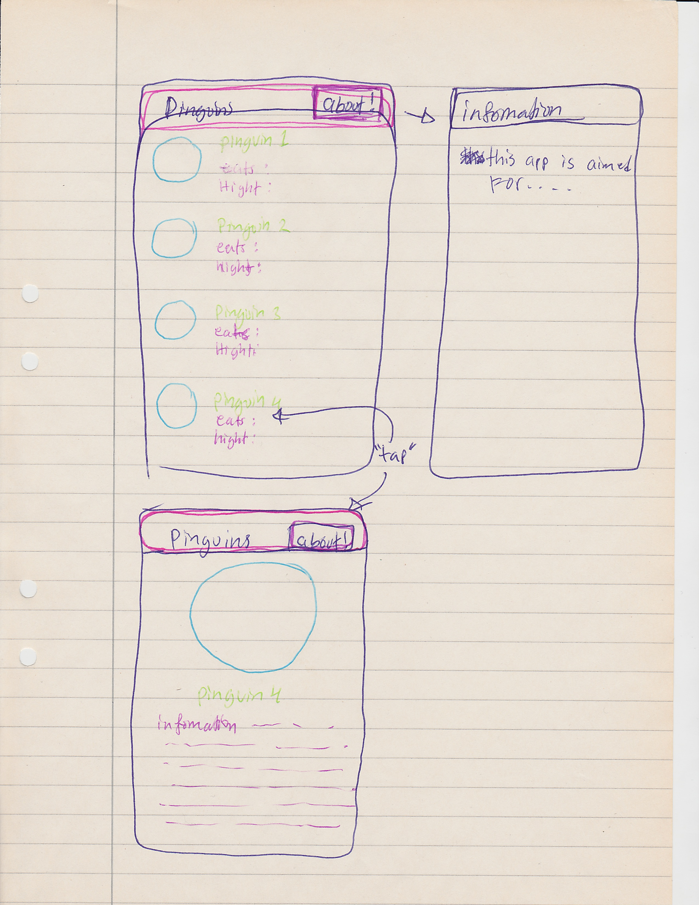
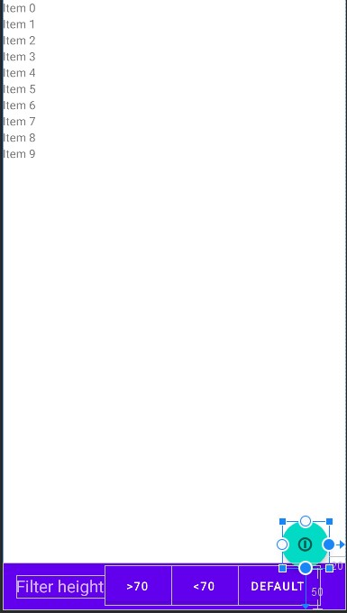
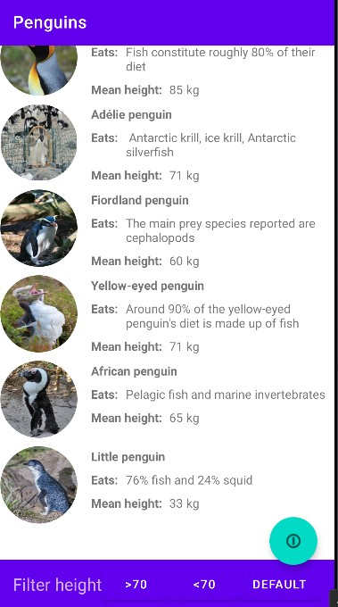

# Rapport Projekt

# Skiss/design-idé


Bild 1

# Webbtjänst - JSON

I JSON Strängen används attributen, namn, location, size och auxdata, som i sin tur innehåller attributen info och img.

"namn" attributen används för att namnge pingvinen, denna sträng kopplas d.v.s. till __TextView__ widgeten för namn.
"location" innehåller text information om vad pingvinen äter för något, attributet döps om i Penguin klassen till "eats".
"size" har värdet för den genomsnitliga storleken för sedda pingvin i meter.
"auxdata" är i sig ett eget objekt som skapas i objektet. Denna innehåller ytterligare två attribut.
"auxdata (info)" innehåller den detalierade informationen om pingvinen i fråga.
"auxdata (img)" innhåller URL:en till en bild på den pingvin som är relaterat till objektet   

````JSON
{
    "ID": "a21jeaha11",
    "name": "King penguin",
    "type": "a21jeaha",
    "company": "",
    "location": "Fish constitute roughly 80% of their diet",
    "category": "",
    "size": 85,
    "cost": 0,
    
    "auxdata": {
      "info": "The king penguin (Aptenodytes patagonicus) is the second largest species of penguin, smaller, but somewhat similar in appearance to the emperor penguin. There are two subspecies: A. p. patagonicus and A. p. halli; patagonicus is found in the South Atlantic and halli in the South Indian Ocean (at the Kerguelen Islands, Crozet Island, Prince Edward Islands and Heard Island and McDonald Islands) and at Macquarie Island. King penguins mainly eat lanternfish, squid and krill. On foraging trips, king penguins repeatedly dive to over 100 metres (300 ft), and have been recorded at depths greater than 300 metres (1,000 ft). Predators of the king penguin include giant petrels, skuas, the snowy sheathbill, the leopard seal and the orca. King penguins breed on the Subantarctic islands at the northern reaches of Antarctica, South Georgia, and other temperate islands of the region. ",
      "img": "https://upload.wikimedia.org/wikipedia/commons/b/ba/Aptenodytes_patagonicus_-St_Andrews_Bay%2C_South_Georgia%2C_British_Overseas_Territories%2C_UK_-head-8_%281%29.jpg"
    }
}
````
figur 1
# Implementationsexempel

Det enda aspektet ur skissen som inte implementerats som tänk vid skapadet av layouten är "About"-knappen, detta då svårigheter uppkom kring hanteringen och ändringen av den förinstallerade "toolbaren". Istället valdes det att implementera en __"svävande knapp"__.
Denna hanterades som vilken annan knapp som helst. se nedan. Knappen implementeras både i `activity_main` och `activity_deteil_penguin`, dessa ger ilusionen av att det bara är en enda knapp, men i själva värket är det två olika knappar.

Länk till relevant commit: https://github.com/a21jeaha/Projekt_Webbutveckling_Programmering_av_mobila_applikationer/tree/bb151bdce881a5d8513a3991fb91c401568f7bea

Den orginella tanken var att skappa en toolbar med knapp i, men vid skappandet och testandet insågs det att det redan fanns en toolbar installerad, den nya hamnade där med under den vilket inte gav det önskade resultatet.
Att arbeta med den förinstallerade toolbaren visade sig inte vara så enkelt, därför togs beslutet att ändra på layouten, man ser resultatet i bilden nedan. 

```xml
<com.google.android.material.floatingactionbutton.FloatingActionButton
        android:id="@+id/floatingActionButton"
        android:layout_width="wrap_content"
        android:layout_height="wrap_content"
        android:layout_marginEnd="20dp"
        android:layout_marginBottom="50dp"
        android:clickable="true"
        app:layout_constraintBottom_toBottomOf="parent"
        app:layout_constraintEnd_toEndOf="parent"
        app:srcCompat="@android:drawable/ic_menu_info_details"

        />
``` 
figur 2

````java
public class MainActivity extends AppCompatActivity implements JsonTask.JsonTaskListener{
// överflödig kod har tagits bort från denna kod 
    
    // knappar
    private FloatingActionButton floatingActionButton1;

    @Override
    protected void onCreate(Bundle savedInstanceState) {
        super.onCreate(savedInstanceState);
        setContentView(R.layout.activity_main);

        // knapp - widget association
        floatingActionButton1 = findViewById(R.id.floatingActionButton);

        // öppnar ny aktivitet
        floatingActionButton1.setOnClickListener(new View.OnClickListener() {
            @Override
            public void onClick(View view) {
                startActivity(intentAbout);
            }
        });
````
figur 3 

 


# Implementationsexempel VG
# Reflektion